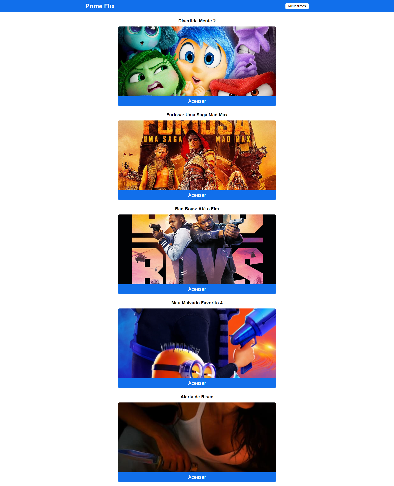

# Prime Flix

Esse projeto foi desenvolvido durante o curso React Js do zero ao avançado na prática de Matheus Fraga na Udemy.

## Tecnologias utilizadas

Esse projeto foi desenvolvido com as seguintes tecnologias:

- JavaScript;
- React.js;
- React Router Dom
- React Toastify
- Axios

### O projeto consome a API do [The Movie Database (TMDB)](https://www.themoviedb.org/).

## Sobre

O Prime Flix é uma aplicação que consome uma API e fornece acesso aos 10 filmes atuais em cartaz. Através dessa aplicação é possível visualizar detalhes de cada filme selecionado, como a imagem do cartaz, sinopse, avaliação e acessar o trailer. Também é possível adicionar um filme a lista de favoritos, assim como excluí-lo da lista.

## Preview Desktop

    

## Instruções

- Certifique-se que você tem instalado na sua máquina **npm**.
- Pelo terminal navegue até a pasta do projeto utilizando `cd curso-react-zero-avancado`.
- Execute o comando `npm install` para instalar as dependências.
- Após isso execute o comando `npm start` e a aplicação deverá ser inicializada em uma aba no seu navegador.
